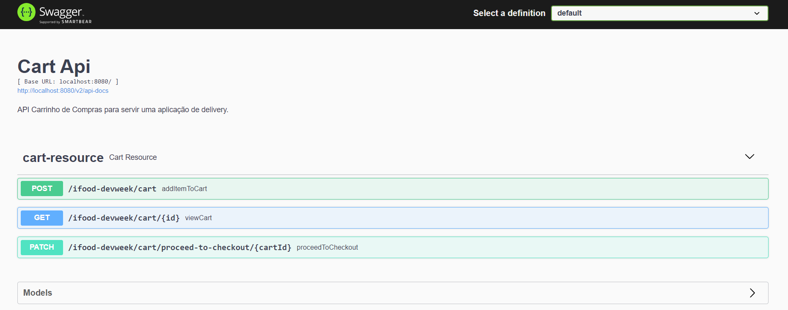

<h1>Cart Api 🛒</h1>

Shopping Cart Api to serve a delivery application developed in Ifood-Dev-Week promoted by Digital Innovation One.

<a href="https://docs.google.com/presentation/d/1O_lCZFiuU9MOsot-pJv2lb7kKrRs4ykW/edit?usp=sharing&ouid=101340348592910912358&rtpof=true&sd=true">Slides class 01</a> ❤️ 
<a href="https://docs.google.com/presentation/d/14JDFLaWvK6KL_9ZxubRoBciWQ_aVcxd4/edit?usp=sharing&ouid=101340348592910912358&rtpof=true&sd=true">Slides class 02</a> ❤️
<a href="https://docs.google.com/presentation/d/11rOmP1u7nwYv5mL4ovmquYMZWktPwIiJ/edit?usp=sharing&ouid=101340348592910912358&rtpof=true&sd=true">Slides class 03</a> ❤️ 
<a href="https://docs.google.com/presentation/d/162KrAjBivpN4GKzPVwv7y-JcIPUnN1_h/edit?usp=sharing&ouid=101340348592910912358&rtpof=true&sd=true">Slides class 04</a>

<h3>💡 Features</h3>

- [x] Add items to shopping cart 
- [x] View shopping cart 
- [x] Close shopping cart 
- [ ] Delete item from shopping cart 

<h3>⚙️ Accessing Application</h3>

Run in git terminal the command: <code>./gradlew bootrun</code> or run CartApiApplication.java file to be able to access:

<a href="http://localhost:8080/h2-console/login.jsp"> 🗄️ Cart Api H2 Database</a> 
<a href="https://drive.google.com/file/d/1jtVv1nTIh0FikMXv5kZhjoUw2znBJYTF/view?usp=sharing"> 🚀 Collection Cart Api - Postman</a> 
<a href="http://localhost:8080/swagger-ui/"> 🟢 Cart Api - Swagger</a> 

<h3>💻 Technologies / Tools</h3>

- Java
- Postman
- Spring Initialzr (Gradle Project)

<table>
<tr>
	<th>Dependencies</th>
	<th>Version</th>
</tr>
<tr>
	<td>spring-boot-starter-web</td>
	<td>2.7.4</td>
</tr>
<tr>
	<td>spring-boot-starter-data-jpa</td>
	<td>2.7.4</td>
</tr>
<tr>
	<td>lombok</td>
	<td>1.18.24</td>
</tr>
<tr>
	<td>springfox-boot-starter</td>
	<td>3.0.0</td>
</tr>
<tr>
	<td>h2-database</td>
	<td>2.1.214</td>
</tr>
</table>